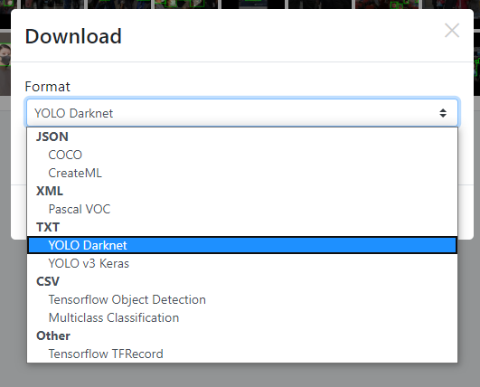

# Feature Request

### File Output
- Number of file output for reference  

  

### File Saving  
- Able to specify location to save  
  - For example YOLO, label txt file has to be in the same place as image file  
  - The designated saving location (Downloads) might be full of files and makes things messy to filter  
  
### Project  
- Showing information about project  
    - when is it created  
    - when last opened  
    - how many images inside  
    - versions of projects    
- Able to delete project  

### Image  
- Support pdf version as image?

### Docs  
- blog/talks on how to do labelling to yolov4  

