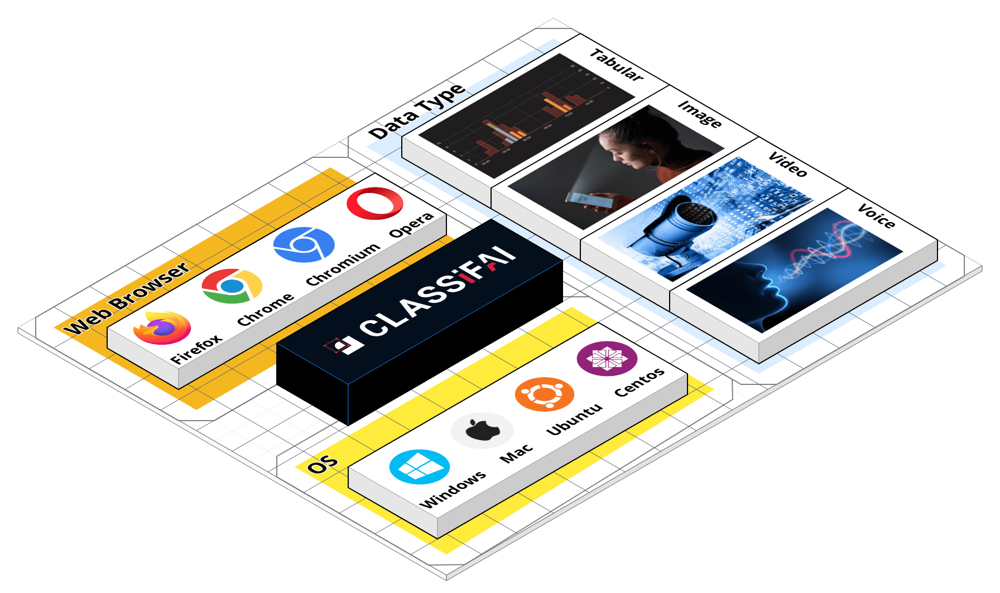
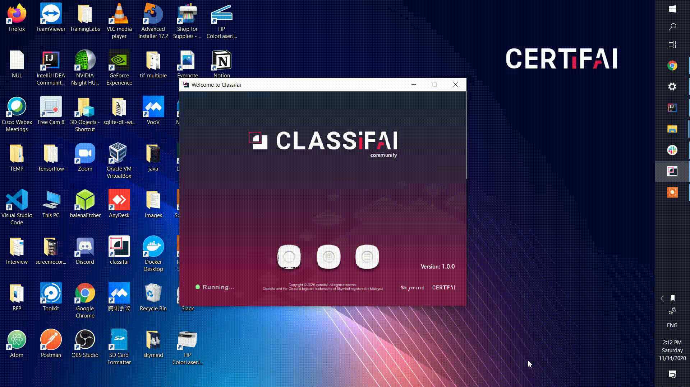

<p align="center">

</p>    

<p>
  <p align="center">
    <a href="https://github.com/CertifaiAI/classifai/blob/main/LICENSE">
        
    </a>
    <a href="https://github.com/CertifaiAI/classifai/releases">
        
    </a>
    <a href="https://img.shields.io/sonar/quality_gate/CertifaiAI_classifai?server=https%3A%2F%2Fsonarcloud.io">
        
    </a>
    <a href="https://classifai.ai">
        
    </a>
    <a href="Discord">
        
    </a>
</p>


<h3 align="center">
Data Annotation Platform for AI Training
</h3>

[](https://sourcerer.io/fame/codenamewei/CertifaiAI/classifai/links/0)[](https://sourcerer.io/fame/codenamewei/CertifaiAI/classifai/links/1)[](https://sourcerer.io/fame/codenamewei/CertifaiAI/classifai/links/2)[](https://sourcerer.io/fame/codenamewei/CertifaiAI/classifai/links/3)[](https://sourcerer.io/fame/codenamewei/CertifaiAI/classifai/links/4)[](https://sourcerer.io/fame/codenamewei/CertifaiAI/classifai/links/5)[](https://sourcerer.io/fame/codenamewei/CertifaiAI/classifai/links/6)[](https://sourcerer.io/fame/codenamewei/CertifaiAI/classifai/links/7)

**Classifai** is one of the most comprehensive open-source data annotation platform.  
It supports the labelling of various data types with multi labelled outputs forms for AI model training.  

Figure below show how Classifai fits in the machine learning workflow. \
It enables the labelling of raw data imported from data source. \
The labelled data can then channel into training environments for supervised / semi-supervised learning.

<p align="center">
  
</p>

Data labelling tasks are challenging due to a few factors:
- long hours of human workforce to label the data manually, 
- off-the-shelves toolkit which cannot fulfill the use cases needs.
- frustration processes to convert data to supported format types for labelling work

We aim to solve these in **Classifai** by providing significant value to the data science workflow.

<p align="center">
  
</p>


## Features
- Platform-agnostic
  -  Classifai is build with Java backend. \
     As Java is platform-neutral, it is as simple as download the classifai uber jar file and run it with Java runtime.
- Asynchronous API - Fast and speedy response
- In-memory Java-based database
- Conversion of conventional data types to preferred formats (For example: .pdf format to .png format)
- Multi data types supported
<center>
  
| Images        | Documents|Video|Tabular|Voice|
|:-------------:|:-------------:|:-------------:|:-------------:|:-------------:|
|jpg, JPEG, JPG| pdf |Coming soon... |Coming soon... |Coming soon... |
|png, PNG| | | | | |
|tif, tiff| | | | | |  
|bmp| | | | | |  

</center>

- [Stay tune with these features coming up below]   
  - **AI in the Loop** - Deep Learning assistant for labelling task to reclaim valuable time for meaningful ML/DL tasks.  
  - Support labelling of more data types in demand - video, tabular and voice data
  - Data management


## Strengths of the tool
- Scale data labelling operations to massive real world dataset
- Cut costly data labelling services
- Aesthetic and intuitive UI interface, to make the work fun to do!
- Reclaim valuable time from inefficient data labelling, technical team can focus on more meaningful ML/DL tasks.

## Quick Tour

**Classifai** support **bounding box** and **segmentation** annotation for now.  
Click on the sub-category accordingly for the desired operation. 

**Bounding Box Annotation**
<p align="center">
  
</p>

**Segmentation Annotation**
<p align="center">
  
</p>

**Classifai** is a web-based application which can opens in either **Chrome, Firefox** browser \
or any Chromium-based browser such as **Opera** and **Vivaldi**. \
(Note: Internet Explorer & Microsoft Edge is not supported)  

There are two ways to open classifai in the browser
1. Click on the first button of **Welcome Launcher**

<p align="center">
  
</p>

2. Alternatively, start classifai,  
then proceed to open a browser and put in url _http://localhost:9999/_

<p align="center">
  
</p>

**Conversion of files** \
We put into great thought into how data scientists build modelling with data.  

When building use cases such as Optical Character Recognition (OCR) or medical related use cases,  
often the raw data formats such as pdf/tif were not commonly used in the modelling.  

Let alone data labellers were facing a hard time trying to convert these files into supported formats.  

**Classifai** comes with a Conversion Launcher.  
Currently supporting the conversion of format of **pdf/tif** to **png/jpg**.  

<p align="center">
  
</p>

## Installation

Classifai supports the following Operating Systems.  

<p align="center">
  
</p>

Installation comes in distribution built with Java for each operating system.  
The installation packages and formats are listed below.

| Operating System | Supported Version | Installation package format |
|:-------------:|:-------------:|:-------------:|
| [Windows](https://s3.eu-central-1.wasabisys.com/classifai/window_distribution/classifai-win-1.1.1.msi) | 7, 8, 10 | msi|
| [Mac](https://s3.eu-central-1.wasabisys.com/classifai/mac_distribution/classifai-1.1.1.pkg) | 10 | pkg |
| Ubuntu | [18 LTS](https://s3.eu-central-1.wasabisys.com/classifai/ubuntu_distribution/classifai-ubuntu18-1.1.1.deb), [20 LTS](https://s3.eu-central-1.wasabisys.com/classifai/ubuntu_distribution/classifai-ubuntu20-1.1.1.deb) | deb |
| Centos | [7](https://s3.eu-central-1.wasabisys.com/classifai/centos_distribution/classifai-centos7-1.1.1.rpm), [8](https://s3.eu-central-1.wasabisys.com/classifai/centos_distribution/classifai-centos8-1.1.1.rpm) | rpm |

Alternatively, download the [uber jar file](https://s3.eu-central-1.wasabisys.com/classifai/uber_jar/classifai-uberjar-1.1.1.jar) and run with Java JDK/JRE 14.  
```
java -jar classifai-uberjar-dev.jar --unlockdb --port=9999
```

## Learn More 


| Section | Description |
|:-------------:|:-------------:|
| [Website](https://classifai.ai/) | Official Website|
| [Documentation](https://docs.classifai.ai/) | Full API documentation and tutorials |
| [Blogs](https://medium.com/classifai-ai) | Technical Posts |
| [Discord](https://discord.gg/WsBFgNP) | Community Support for Classifai Tool |
| Training (Coming Soon) | Self-Paced Training to learn about Data Annotation and the use of Classifai |

## Contact us

For custom functionality development support, enterprise support and other related questions, \
contact the team at _hello@classifai.ai_:smiley:
